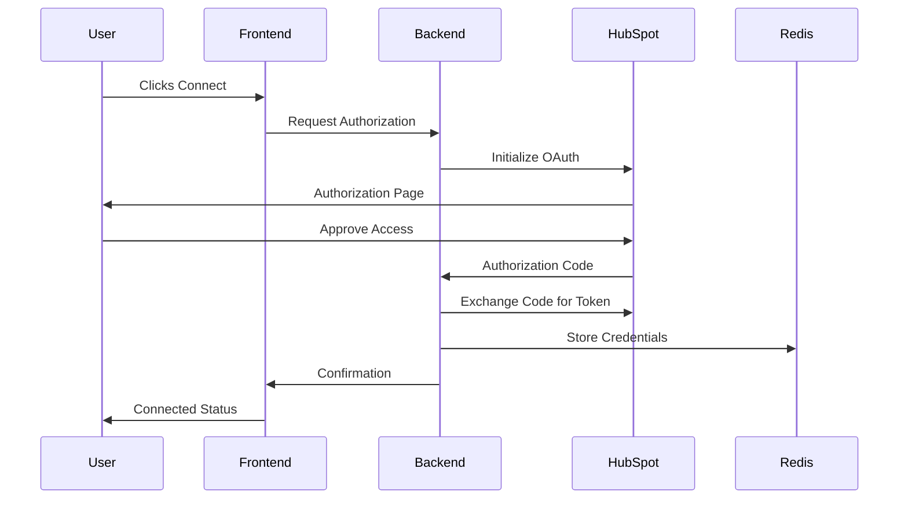
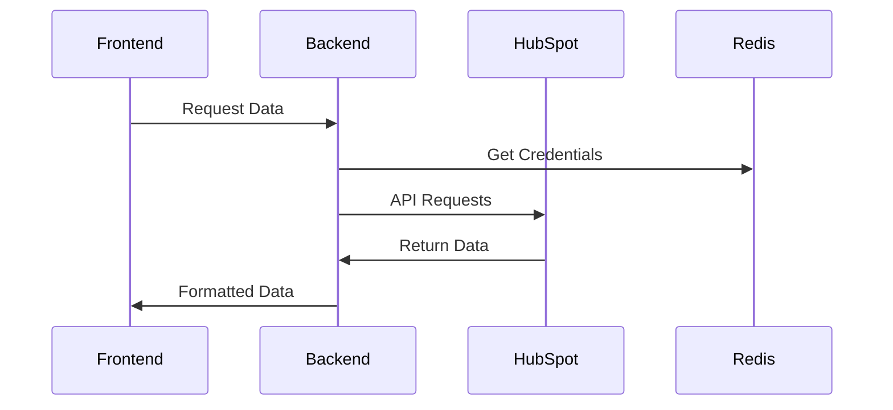

# VectorShift HubSpot Integration

A robust integration system that connects VectorShift with HubSpot CRM, enabling seamless access to contacts, companies, and deals data through a secure OAuth2 authentication flow.

## Author
**Gaurav**

## Explanation YoutTube Video
https://youtu.be/C3Ctvthr3jw?si=1DZUjN2Pypc-_Qqp

## Table of Contents
- [Overview](#overview)
- [Features](#features)
- [Technical Architecture](#technical-architecture)
- [Installation](#installation)
- [Usage](#usage)
- [Workflow](#workflow)
- [Security](#security)
- [API Documentation](#api-documentation)
- [Contributing](#contributing)
- [License](#license)
- [Acknowledgments](#acknowledgments)

## Overview
This project implements a full-stack integration between VectorShift and HubSpot, featuring:
- **Secure OAuth2 authentication**
- **Real-time data synchronization**
- **Standardized data formatting**
- **User-friendly interface**
- **Temporary credential management**

## Features
- **OAuth2 Authentication**: Secure authentication flow with HubSpot
- **Data Retrieval**: Access to:
  - Contacts
  - Companies
  - Deals
- **Temporary Credential Storage**: Redis-based secure credential management
- **Standardized Data Format**: Consistent `IntegrationItem` structure
- **Error Handling**: Comprehensive error management
- **User Interface**: React-based frontend with Material-UI

## Technical Architecture

### Backend (FastAPI)
```
backend/
├── integrations/
│   ├── hubspot.py        # HubSpot integration logic
│   ├── airtable.py       # Airtable integration
│   ├── notion.py         # Notion integration
│   └── integration_item.py # Shared data structure
└── main.py               # FastAPI application
```

### Frontend (React)
```
frontend/
└── src/
    ├── integrations/
    │   ├── HubSpotIntegration.js
    │   ├── airtable.js
    │   └── notion.js
    ├── App.js
    ├── integration-form.js
    └── data-form.js
```

## Installation

### Prerequisites
- Python 3.7+
- Node.js
- Redis Server
- HubSpot Developer Account

### Backend Setup
```bash
# Clone repository
git clone [repository-url]

# Install dependencies
cd backend
pip install -r requirements.txt

# Set environment variables
export HUBSPOT_CLIENT_ID="your_client_id"
export HUBSPOT_CLIENT_SECRET="your_client_secret"
export HUBSPOT_REDIRECT_URI="http://localhost:8000/integrations/hubspot/oauth2callback"

# Start Redis
redis-server

# Start backend server
uvicorn main:app --reload
```

### Frontend Setup
```bash
cd frontend
npm install
npm start
```

## Usage

### 1. HubSpot App Configuration
- Create app at [HubSpot Developer Portal](https://developers.hubspot.com/)
- Configure OAuth settings:
  - `oauth2callback`
- Add required scopes:
  - `crm.objects.contacts.read`
  - `crm.objects.contacts.write`
  - `crm.objects.companies.read`
  - `crm.objects.deals.read`

### 2. Integration Flow
- Select **HubSpot** from integration dropdown
- Click **"Connect to HubSpot"**
- Complete OAuth authentication
- Use **"Load Data"** to retrieve HubSpot items

## Workflow

### Authentication Flow


### Data Retrieval Flow


## Security
- OAuth2 implementation with **state parameter**
- Temporary credential storage in **Redis**
- Automatic **credential cleanup**
- Secure API communication
- Comprehensive **error handling**

## API Documentation

### Backend Endpoints
#### HubSpot Integration
- `GET /integrations/hubspot/items` - Retrieve HubSpot data

### Data Structures
```python
class IntegrationItem:
    id: str
    type: str
    name: str
    creation_time: datetime
    last_modified_time: datetime
    url: str
    visibility: bool
```

## Contributing
1. Fork the repository
2. Create your feature branch (`git checkout -b feature/AmazingFeature`)
3. Commit your changes (`git commit -m 'Add some AmazingFeature'`)
4. Push to the branch (`git push origin feature/AmazingFeature`)
5. Open a **Pull Request**

## License
This project is licensed under the **MIT License** - see the `LICENSE.md` file for details.

## Acknowledgments
- [HubSpot API Documentation](https://developers.hubspot.com/docs/api/overview)
- [FastAPI Framework](https://fastapi.tiangolo.com/)
- [React](https://react.dev/) and [Material-UI](https://mui.com/)
- [Redis](https://redis.io/)
